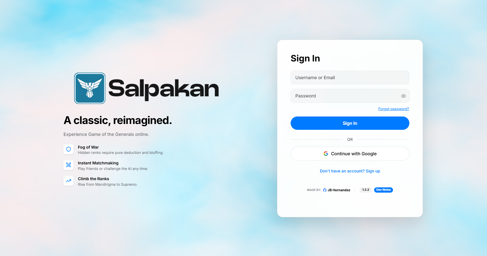
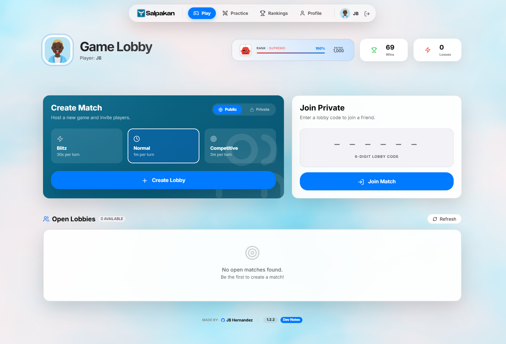
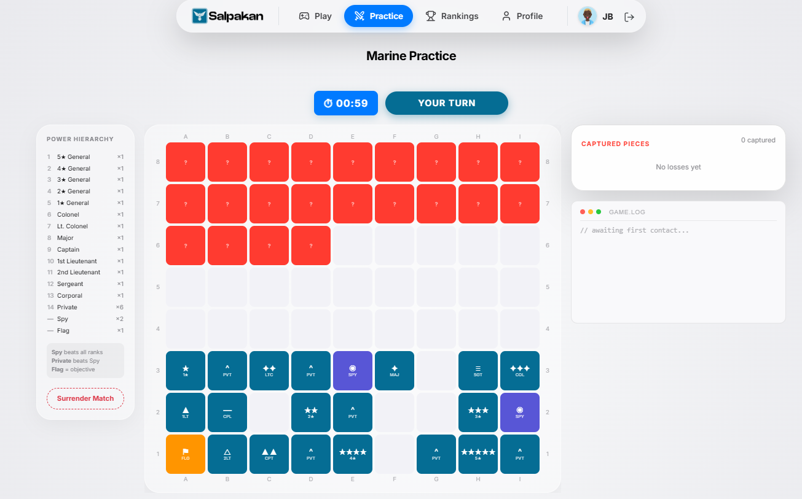
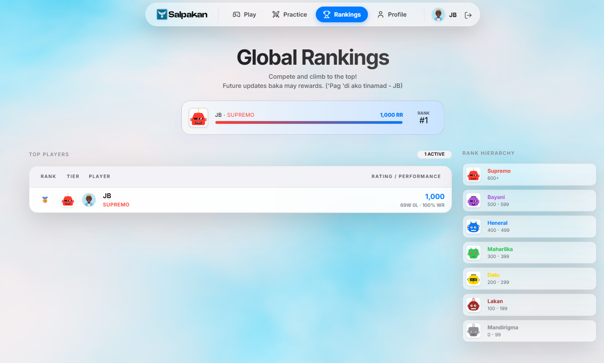
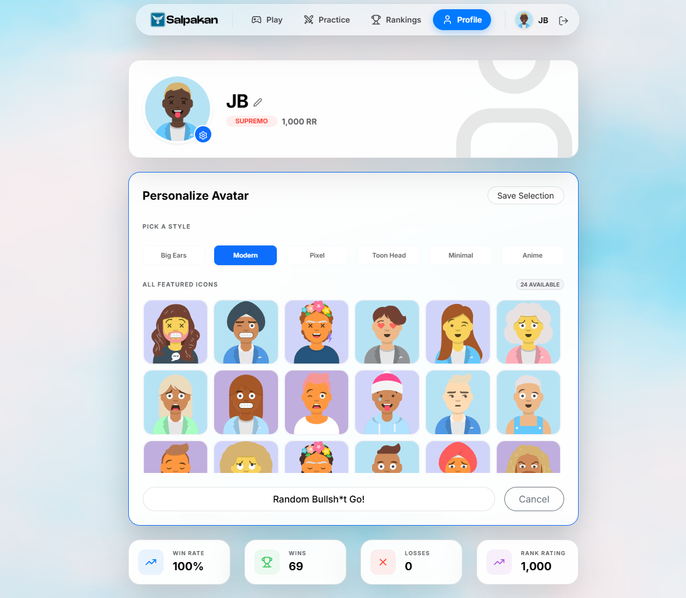

# Salpakan Online (Game of the Generals)


Salpakan Online is a digital recreation of the classic Philippine board game, **Game of the Generals**. Developed by **JB Hernandez**, this platform brings tactical deduction and hidden-information strategy into the modern era with competitive rankings and elite AI training modules.

## Screenshots

<div align="center">
  <p><strong>Login and Authentication</strong></p>
  
  <br><br>
  <p><strong>Lobby and Matchmaking</strong></p>
  
  <br><br>
  <p><strong>Competitive Battlefield</strong></p>
  
  <br><br>
  <p><strong>Global Rankings</strong></p>
  
  <br><br>
  <p><strong>Customizable Profile</strong></p>
  
</div>

## Project Overview
Salpakan is a game of "mental combat" where two commanders lead their armies to capture the enemy flag. Every piece is hidden, and success depends on memory, deduction, and psychological warfare.

### Key Features
- **Live Matchmaking**: Host or join real-time tactical encounters.
- **RR System**: A competitive "Rank Rating" (RR) system with 100-RR intervals.
- **Cultural Ranks**: A 7-tier hierarchy from *Mandirigma* to *Bayani*.
- **Command Training**: Multi-tier AI practice against units like *SAF Elite* and *Scout Rangers*.
- **Command Center**: A high-contrast dashboard with real-time stat tracking.

## Tech Stack

### Frontend & UI
- **Framework**: [React.js](https://reactjs.org/) (Vite)
- **Icons**: [Lucide React](https://lucide.dev/)
- **Components**: [SweetAlert2](https://sweetalert2.github.io/)
- **Styling**: Vanilla CSS (Custom Glassmorphism Design System)

### Backend & Infrastructure
- **Service**: [Supabase](https://supabase.com/) (PostgreSQL + Realtime)
- **Auth**: Supabase Auth (Email/Password)
- **Avatars**: [Dicebear API](https://dicebear.com/) (Procedural generation)

## Project Structure
```text
salpakan/
├── src/
│   ├── assets/       # Visual assets & banners
│   ├── components/   # Reusable UI components
│   ├── context/      # Auth & Global State providers
│   ├── lib/          # Utilities, constants & game logic
│   ├── pages/        # Main application screens
│   ├── App.jsx       # Main router & layout controller
│   └── main.jsx      # Entry point
├── public/           # Static files
└── index.html        # HTML Template
```

## Rank Hierarchy
| Rank | Threshold | Title |
| :--- | :--- | :--- |
| 1 | 0-99 RR | Mandirigma |
| 2 | 100-199 RR | Lakan |
| 3 | 200-299 RR | Datu |
| 4 | 300-399 RR | Maharlika |
| 5 | 400-499 RR | Heneral |
| 6 | 500-599 RR | Bayani |
| 7 | 600+ RR | Supremo |


